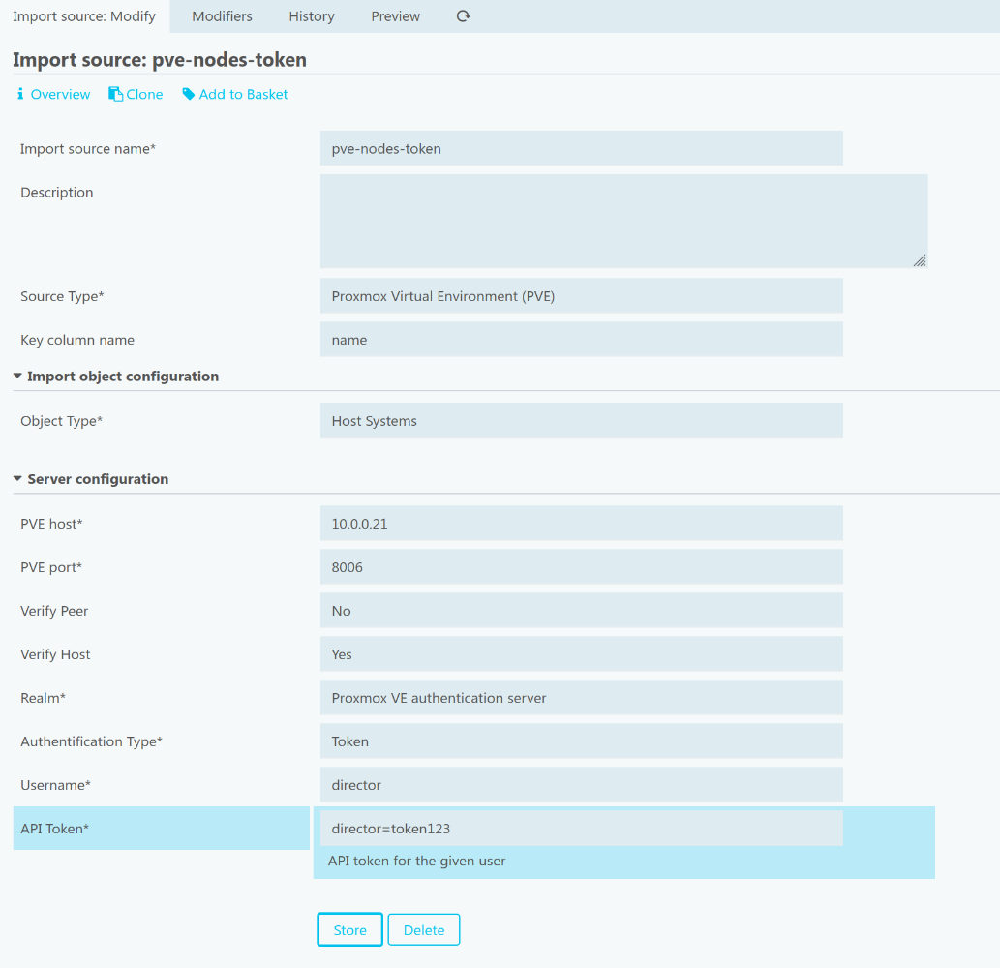

# Configuration

## Create Proxmox VE user

The module needs a Proxmox VE user with at least the following permissions:

- `VM.Audit`
- `Pool.Audit`
- `Sys.Audit`

> **Note**: If the values from QEMU guest agent should be fetch too, additionally the permission `VM.Monitor` is required.

For authentification either a API token or the users password can be used. It is highly recommended to use the API token though.

See the official Proxmox VE documentation for more information on how to create user, role and API token.

## Create an import source

### General

The following steps are necessary for all kinds of object types. Below you find additional instructions, which are specific to certain object types.

1. Create a new import source in Director
2. Select `Proxmox Virtual Environment (Proxmox VE)` in the `Source Type` list
3. Configure the host details according to your local setup (section `Server configuration`)

### Import source for nodes

Create an import source and perform the basic configuration as described above.

Additionall steps:

- Choose `Host Systems` in the `Object Type` list
- Set the `Key column name` (usually `name` for a node)

Example:

### Import source for virtual machines

Create an import source and perform the basic configuration as described above.

Additionall steps:

- Choose `Virtual Machines` in the `Object Type` list
- Set the `Key column name` (usually `vm_id` or `vm_name` for a virtual machine)

### Import source for storages

Create an import source and perform the basic configuration as described above.

Additionall steps:

- Choose `Storages` in the `Object Type` list
- Set the `Key column name` (usually `storage_id` for a resource pool)

### Import source for resource pools

Create an import source and perform the basic configuration as described above.

Additionall steps:

- Choose `Pools` in the `Object Type` list
- Set the `Key column name` (usually `pool_id` for a resource pool)
